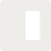

<p align="center">
  
</p>

<h1 align="center">engram</h1>

<p align="center">
  A small GPUI-based component library - a Zed-flavored UI toolkit built on <code>gpui</code> from the (unreleased) Zed source.
</p>

<p align="center">
  
</p>

<p align="center">
  
  
</p>

`engram` is a Cargo workspace with three crates that downstream apps consume through the umbrella `engram` crate:

```rust
use gpui_engram::prelude::*;
```

## Workspace

| crate | role |
|---|---|
| `gpui-engram` | umbrella facade - re-exports `gpui_engram_theme` and `gpui_engram_ui` |
| `gpui-engram-theme` | theme tokens (`Color`, `Spacing`, `Radius`, `TextSize`) + `ActiveTheme` global |
| `gpui-engram-ui` | component primitives + shared traits + embedded SVG assets |

## Quick start

```rust
fn main() {
    Application::new()
        .with_assets(gpui_engram_ui::Assets)
        .run(|cx| {
            gpui_engram_theme::init(cx);
            gpui_engram_ui::init(cx);
            // ... open your window
        });
}
```

The two `init` calls are not optional - `gpui_engram_theme::init` installs the default dark theme as a GPUI global, and `gpui_engram_ui::init` registers the `TextField` keybindings. To use icons, the asset source must be wired through `Application::with_assets`.

The canonical way to eyeball every component is the showcase example:

```bash
cargo run --example showcase -p gpui-engram # multi-theme showcase (all components, light + dark)
cargo run -p story                          # sidebar gallery with per-component nav + theme switching
```

## Status

`engram` is pre-1.0. The surface is expected to be stable enough to build against, but:

- **`gpui` dependency is git-pinned.** `gpui` and `gpui_platform` come from `zed-industries/zed` at a specific revision (see `Cargo.toml`). Engram cannot be published to crates.io until `gpui` itself is on crates.io; meanwhile consumers depend on engram as a git dep too. Bumping the pin is an intentional per-release action.
- **Accessibility.** GPUI does not yet expose a platform accessibility API, so engram inherits that gap. Screen reader support is not available today.

See [`CHANGELOG.md`](CHANGELOG.md) for release notes.

## License

Dual-licensed under either of:

- Apache License, Version 2.0 ([LICENSE-APACHE](LICENSE-APACHE) or <http://www.apache.org/licenses/LICENSE-2.0>)
- MIT License ([LICENSE-MIT](LICENSE-MIT) or <http://opensource.org/licenses/MIT>)

at your option.

### Third-party content

- **Icons** - `crates/engram-ui/assets/icons/` ships ~140 SVG icons sourced from [Lucide](https://lucide.dev), licensed under [ISC](crates/engram-ui/assets/icons/LICENSES). One derivative (`star_filled.svg`) is Lucide's `star` modified to use `fill="currentColor"`.
- **`crates/engram-ui/src/components/text_field.rs`** - derived from `crates/gpui/examples/input.rs` in [zed-industries/zed](https://github.com/zed-industries/zed) (Apache-2.0). The file header carries the derivation notice required by Apache-2.0 §4(b).

### Contribution

Unless you explicitly state otherwise, any contribution intentionally submitted for inclusion in engram by you, as defined in the Apache-2.0 license, shall be dual licensed as above, without any additional terms or conditions.
